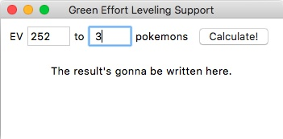
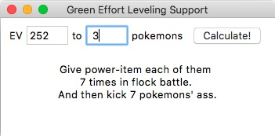

EffortLevelingSupport
===

tkinterを使ってるのでpython3専用。ポケモンの努力値振りをサポートします。

以下の条件のときが対象。

    ● n体以上のポケモンにeずつ努力値を振りたい
    ● ただしパワー系アイテムが一個しかない

以下のようなことを教えてくれます

    ● 「パワーアイテムを各ポケモンに順番に持たせそれぞれ群れバトルx戦せよ」
    ● 「その後、パワーアイテムをもたせず一体戦をy戦せよ」
